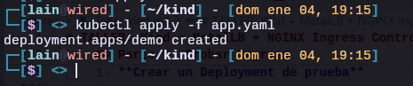
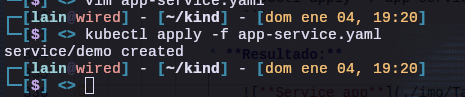
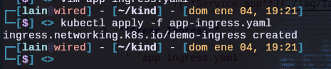

# TALLER: Kind + MetalLB + NGINX Ingress Controller

* **Arquitectura Final**

    ```bash
    Internet / Host
    ↓
    MetalLB (IP externa simulada)
    ↓
    NGINX Ingress Controller (LoadBalancer)
    ↓
    Service (ClusterIP)
    ↓
    Pods
    ```
    ## Parte 1: Prerequisitos

    1. **Sistema base**

        * Ubuntu 24.04
        * Docker instalado
        * kubectl instalado
    
    2. **Instalar Docker**

        ```bash
        sudo apt install docker.io
        ```
        * Instala el motor de contenedores
        * Kind usa Docker para crear nodos Kubernetes como contenedores

        * **Permitir usar Docker sin sudo**

            ```bash
            sudo usermod -aG docker $USER
            newgrp docker
            ```
    3. **Instalar kubectl**

        ```bash
        sudo apt-get update
        sudo apt-get install -y apt-transport-https ca-certificates curl gnupg

        curl -fsSL https://pkgs.k8s.io/core:/stable:/v1.35/deb/Release.key | sudo gpg --dearmor -o /etc/apt/keyrings/kubernetes-apt-keyring.gpg
        sudo chmod 644 /etc/apt/keyrings/kubernetes-apt-keyring.gpg # allow unprivileged APT programs to read this keyring

        echo 'deb [signed-by=/etc/apt/keyrings/kubernetes-apt-keyring.gpg] https://pkgs.k8s.io/core:/stable:/v1.35/deb/ /' | sudo tee /etc/apt/sources.list.d/kubernetes.list
        sudo chmod 644 /etc/apt/sources.list.d/kubernetes.list   # helps tools such as command-not-found to work correctly

        sudo apt-get update
        sudo apt-get install -y kubectl
        ```
        * Cliente de Kubernetes
        * Habla con `kube-apiserver`
        * Envia YAMLs y comandos
    
    4. **Instalar Kind**

        ```bash
        [ $(uname -m) = x86_64 ] && curl -Lo ./kind https://kind.sigs.k8s.io/dl/v0.31.0/kind-linux-amd64
        chmod +x ./kind
        sudo mv ./kind /usr/local/bin/kind
        ```
        * Kubernetes IN Docker
        * Cada nodo = contenedor Docker
        * Ideal para labs y testing

    * **Resultado:**

        

    ## Parte 2: Crear el clúster (Control Plane + Worker)

    1. **Archivo de configuracion del clúster**

        * `kind-cluster.yaml`

            ```yaml
            kind: Cluster
            apiVersion: kind.x-k8s.io/v1alpha4
            nodes:
            - role: control-plane
            - role: worker
            ```
            * `kind: Cluster` -> Tipo de recurso de Kind
            * `control-plane` -> Nodo maestro
            * `worker` -> Nodo que ejecuta Pods
            * No usamos LoadBalancer aquí (MetalLB lo hará)

    2. **Crear el clúster**

        ```bash
        kind create cluster --name workshop --config kind-cluster.yaml
        ```
        1. Docker crea 2 contenedores
        2. Se instala Kubernetes Dentro
        3. kube-apiserver se inicia
        4. kubectl se configura automáticamente

    3. **Verificar Nodos**

        ```bash
        kubectl get nodes
        ```
    
    * **Resultado:**

        
    
    ## Parte 3: Instalar MetalLB

    * **Porque MetalLB aquí ?**

        * Kind **no tiene LoadBalancer**
        * Kubernetes deja el Service en `EXTERNAL-IP: <pending>`
        * MetalLB **asigna IPs reales dentro de la red Docker**

    1. **Instalar MetalLB** (Manifiestos oficiales)

        ```bash
        kubectl apply -f https://raw.githubusercontent.com/metallb/metallb/v0.14.5/config/manifests/metallb-native.yaml
        ```
        * Que instala:

            * Namespace `metallb-system`
            * Controller (Deployment)
            * Speaker (DaemonSet)
            * CRDs:
                * IPAddressPool
                * L2Advertisement

    2. **Esperar a que levante**

        ```bash
        kubectl get pods -n metallb-system
        ```
        * Debes ver:

            * Controller Running
            * Speaker Running en cada nodo
        
        * **Resultado:**

            

    3. **Obtener rango IP de Docker**

        ```bash
        docker network inspect kind | grep Subnet
        ```
    
        * **Resultado:**

            

    4. **Crear IPAddressPool**

        * `metallb-ip-pool.yaml`

            ```yaml
            apiVersion: metallb.io/v1beta1
            kind: IPAddressPool
            metadata:
                name: kind-pool
                namespace: metallb-system
            spec:
                addresses:
                - 172.18.255.200-172.18.255.250
            ```
            * Define **IPs que MetalLB puede asignar**
            * Deben pertenecer a la red Docker
            * No deben estar en uso

    5. **Crear L2Advertisement** 

        * `metallb-l2.yaml`

            ```yaml
            apiVersion: metallb.io/v1beta1
            kind: L2Advertisement
            metadata:
                name: l2
                namespace: metallb-system
            ```
            * Kind usa red **Layer 2**
            * MetalLB responde ARP
            * Sin esto -> no anuncia IPs

    6. **Aplicar configuracion**

        ```bash
        kubectl apply -f metallb-ip-pool.yaml
        kubectl apply -f metallb-l2.yaml
        ```

        * **Resultado:**

            

    ## Parte 4: Instalar NGINX Ingress Controller

    1. **Instalar usando manifiesto oficial**

        ```bash
        kubectl apply -f https://raw.githubusercontent.com/kubernetes/ingress-nginx/controller-v1.11.2/deploy/static/provider/kind/deploy.yaml
        ```
        * Que instala:

            * Namespace `ingress-nginx`
            * Deployment del controller
            * Service type LoadBalancer
            * RBAC
            * IngressClass `nginx`
    
        * `ingress-nginx-controller` se crea con:

            ```yaml
            type: Nodeport
            ```
            * Al ser NodePort Queda en Pending porque no asignamos NodeIP:portNode 
        
            * Debemos modificarlo y cambiar: `Nodeport` -> `LoadBalancer`

                ```bash
                kubectl edit svc ingress-nginx-controller -n ingress-nginx
                ```
            
            * **Resultado:**

                
                

        * **Problema de etiquetas:**
            
            1. `kubernetes.io//os=linux`
            2. `ingress-ready=true`

            * Ingresar:

                ```bash
                kubectl edit deployment ingress-nginx-controller -n ingress-nginx 
                ```

            * Eliminar las siguientes lineas:

                ```bash
                nodeSelector:
                    ingress-ready: "true"
                    kubernetes.io/os: linux
                ```

    2. **Verificar Pods**

        ```bash
        kubectl get pods -n ingress-nginx
        ```

        * **Resultado:**

            

    3. **Verificar Service LoadBalancer**

        ```bash
        kubectl get svc -n ingress-nginx
        ```
    
        * **Resultado:**

            

    
    ## Parte 5: Probar Ingress 

    1. **Crear un Deployment de prueba**

        * `app.yaml`

            ```yaml
            apiVersion: apps/v1
            kind: Deployment
            metadata:
            name: demo
            spec:
            replicas: 2
            selector:
                matchLabels:
                app: demo
            template:
                metadata:
                labels:
                    app: demo
                spec:
                containers:
                - name: demo
                    image: hashicorp/http-echo
                    args:
                    - "-text=Hola desde Kubernetes"
                    ports:
                    - containerPort: 5678
            ```
            * Crear Deployment

                ```bash
                kubectl apply -f app.yaml
                ```

            * **Resultado:**

                

        2. **Crear Service ClusterIP**

            * `app-service.yaml`

                ```yaml
                apiVersion: v1
                kind: Service
                metadata:
                name: demo
                spec:
                selector:
                    app: demo
                ports:
                - port: 80
                    targetPort: 5678
                ```
                * Crear Service

                    ```bash
                    kubectl apply -f app-service.yaml
                    ```

                * **Resultado:**

                    
        
        3. **Crear Ingress**

            * `app-ingress.yaml`

                ```yaml
                apiVersion: networking.k8s.io/v1
                kind: Ingress
                metadata:
                    name: demo-ingress
                spec:
                    ingressClassName: nginx
                    rules:
                    - host: demo.local
                      http:
                      paths:
                      - path: /
                        pathType: Prefix
                        backend:
                            service:
                                name: demo
                                port:
                                    number: 80
                ```
                * Crear Ingress

                    ```bash
                    kubectl apply -f app-ingress.yaml
                    ```

                * **Resultado:**

                    
        
        4. **Editar: `/etc/hosts`**

            ```bash
            sudo nano /etc/hosts
            ```

            * Agregar:

                ```bash
                172.18.255.200 demo.local
                ```
        5. **Probar**

            ```bash
            curl http://demo.local
            ```

            * **Resultado:**

                

        * **Pods:**

            