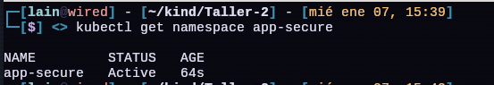
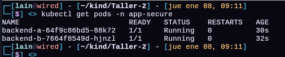
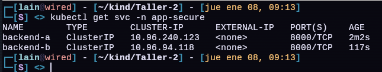
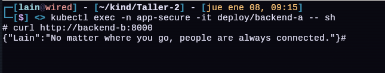

# Taller Calico

* **Arquitectura final**

    ```bash
    Namespace: app-secure

    [Backend A] --(8000)--> [Backend B]
    Funciona Retorna: {"Lain": "No matter where you go, people are always connected."}

    [Backend B] --(8000)--> [Backend A]
    No Funciona queda en Loop
    ```

    ## Parte 1: Prerequisitos

    1. **Sistema Base**

        * Ubuntu 24.04
        * Docker Instalado
        * kubectl instalado

    2. **Instalar Docker**

        ```bash
        sudo apt install docker.io
        ```
        * Instala el motor de contenedores
        * Kind usa Docker para crear nodos Kubernetes como contenedores

        * **Permitir usar Docker sin sudo**

            ```bash
            sudo usarmod -aG docker $USER
            newgrp docker
            ```

    3. **Instalar kubectl**


        ```bash
        sudo apt-get update
        sudo apt-get install -y apt-transport-https ca-certificates curl gnupg

        curl -fsSL https://pkgs.k8s.io/core:/stable:/v1.35/deb/Release.key | sudo gpg --dearmor -o /etc/apt/keyrings/kubernetes-apt-keyring.gpg
        sudo chmod 644 /etc/apt/keyrings/kubernetes-apt-keyring.gpg # allow unprivileged APT programs to read this keyring

        echo 'deb [signed-by=/etc/apt/keyrings/kubernetes-apt-keyring.gpg] https://pkgs.k8s.io/core:/stable:/v1.35/deb/ /' | sudo tee /etc/apt/sources.list.d/kubernetes.list
        sudo chmod 644 /etc/apt/sources.list.d/kubernetes.list   # helps tools such as command-not-found to work correctly

        sudo apt-get update
        sudo apt-get install -y kubectl
        ```
        * Cliente de Kubernetes
        * Habla con `kube-apiserver`
        * Envia YAMLs y comandos
    
    4. **Instalar Kind**

        ```bash
        [ $(uname -m) = x86_64 ] && curl -Lo ./kind https://kind.sigs.k8s.io/dl/v0.31.0/kind-linux-amd64
        chmod +x ./kind
        sudo mv ./kind /usr/local/bin/kind
        ```
        * Kubernetes IN Docker
        * Cada nodo = contenedor Docker
        * Ideal para labs y testing

    ## Parte 2: Crear el clúster (Control Plane + Worker) 

    1. **Archivo de configuracion del clúster**

        ```yaml
        kind: Cluster
        apiVersion: kind.x-k8s.io/v1alpha4
        nodes:
        - role: control-plane
        - role: worker
        ```

        * `kind: Cluster` -> Tipo de recurso de Kind
        * `control-plane` -> Nodo maestro
        * `worker` -> Nodo que ejecuta Pods
        
    2. **Crear el clúster**

        ```bash
        kind create cluster --name test-calico --config kind-cluster.yaml
        ```
        1. Docker crea 2 contenedores
        2. Se instala Kubernetes dentro
        3. Kube-apiserver se inicia
        4. kubectl se configura automáticamente
        

    3. **Verificamos Nodos**

        ```bash
        kubectl get nodes
        ```
    * **Resultado**:

        

    ## Parte 3: Instalar Calico

    * **Porque instalar Calico**

        * Kind tiene CNI basico
        * No permite NetworkPolicy
        * Se necesita un proveedor 
        * Permite ruteo real BGP

    1. **Instalar Calico**

        ```bash
        kubectl apply -f https://raw.githubusercontent.com/projectcalico/calico/v3.27.0/manifests/calico.yaml
        ```

    2. **Esperar a que levante**

        ```bash
        kubectl get pods -n kube-system
        ```
    
    * **Resultado**

        

    ## Parte 4: Crear el Namespace

    * Creamos un Namespace para: Aislar recursos (Pods, Services, RBAC, NetworkPolicy)

        ```yaml
        apiVersion: v1
        kind: Namespace
        metadata:
            name: app-secure
        ```
    
    * Aplicamos el manifiesto

        ```bash
        kubectl apply -f namespace.yaml
        ```
    * Confirmamos que se creo el namespace

        ```bash
        kubectl get namespace app-secure
        ```    
    * **Resultado:**

        

   
   ## Parte 5: Crear app para probar

   * **Aplicación (`app.py`)**

        ```python
        from fastapi import FastAPI

        app = FastAPI()

        @app.get("/")
        async def read_root()
          return {"Lain": "No matter where you go, people are always connected."}
        ```
    
    * **`requirements.txt`**

        ```bash
        fastapi==0.115.2
        uvicorn==0.32.0
        ```

    * **`Dockerfile`**

        ```Dockerfile
        # Dockerfile
        FROM python:3.12.3-slim

        # Configurar el modo no interactivo
        ENV DEBIAN_FRONTEND=noninteractive
        ENV TZ=America/Bogota

        # Instalar dependencias
        RUN apt-get update && apt-get install -y \
            python3 python3-pip \
            && apt-get clean && rm -rf /var/lib/apt/lists/*

        RUN apt-get update && apt-get install curl -y

        # Establecer el directorio de trabajo
        WORKDIR /app

        # Copiar los archivos de requisitos y la aplicación
        COPY requirements.txt .
        RUN pip3 install --no-cache-dir -r requirements.txt
        COPY . .

        # Exponer el puerto que usa FastAPI
        EXPOSE 8000

        # Comando para ejecutar la aplicación
        CMD ["uvicorn", "main:app", "--host", "0.0.0.0", "--port", "8000"]
        ```
        * Escucha en `0.0.0.0`
        * Puerto `8000`
    
    * **Crear imagen**

        ```bash
        docker build -t gilgamesh06/test:1.0 .
        ```
    * **Pasar imagen a kind**

        ```bash
        kind load docker-image gilgamesh06/test:1.0 --name test-calico
        ```
    
    ## Parte 6: Crear Deployment Backend A y Backend B

    1. **Backend A: `backend-a.yaml`**

        ```yaml
        apiVersion: apps/v1
        kind: Deployment
        metadata:
        name: backend-a
        namespace: app-secure
        spec:
        replicas: 1
        selector:
            matchLabels:
            app: backend-a
        template:
            metadata:
            labels:
                app: backend-a
            spec:
            containers:
            - name: backend
                image: gilgamesh06/test:1.0
                ports:
                - containerPort: 8000
        ```
        ```bash
        kubectl apply -f backend-a.yaml
        ```
    
    2. **Backend B: `backend-b.yaml`**

        ```yaml
        apiVersion: apps/v1
        kind: Deployment
        metadata:
        name: backend-b
        namespace: app-secure
        spec:
        replicas: 1
        selector:
            matchLabels:
            app: backend-b
        template:
            metadata:
            labels:
                app: backend-b
            spec:
            containers:
            - name: backend
                image: gilgamesh06/test:1.0
                ports:
                - containerPort: 8000
        ```
        ```bash
        kubectl apply -f backend-b.yaml
        ```

    ## Parte 7: Crear Service Backend A y Backend B

    1. **Backend A: `svc-backend-a.yaml`**

        ```yaml
        apiVersion: v1
        kind: Service
        metadata:
            name: backend-a
            namespace: app-secure
        spec:
            selector:
                app: backend-a
            ports:
            - port: 8000
              targetPort: 8000
        ```
        ```bash
        kubectl apply -f svc-backend-a.yaml
        ```

    2. **Backend B: `svc-backend-a.yaml`**

        ```yaml
        apiVersion: v1
        kind: Service
        metadata:
            name: backend-b
            namespace: app-secure
        spec:
            selector:
                app: backend-b
            ports:
            - port: 8000
              targetPort: 8000
        ``` 
        ```bash
        kubectl apply -f svc-backend-b.yaml
        ```
    
    ## Paso 8: Verificacion 

    * **Pods**

        ```bash
        kubectl get pods -n app-secure
        ```
        * Ambos `Running`

        * **Resultado:**

            
    
    * **Services**

        ```bash
        kubectl get svc -n app-secure
        ```
        * Ambos `ClusterIP`

        * **Resultado:**

            

    ## Paso 9: Prueba de Conectividad

    * Entrar a backend-a:

        ```bash
        kubectl exec -n app-secure -it deploy/backend-a -- sh
        ```
    * Probar backend-b:

        ```bash
        curl http://backend-b:8000
        ```
    * **Resultado esperado**

        ```json
        {"Lain":"No matter where you go, people are always connected."}
        ```
    * **Resultado**

        

    ## Paso 10: Politica `deny-all.yaml`

    ```yaml
    apiVersion: networking.k8s.io/v1
    kind: NetworkPolicy
    metadata:
        name: deny-all
        namespace: app-secure
    spec:
        podSelector: {}
        policyTypes:
        - Ingress
        - Egress
    ```
    ```bash
    kubectl apply -f deny-all.yaml
    ```
    * Efecto:

        * Ningun Pod puede **entrar**
        * Ningun Pod puede **Salir**

    ## Paso 11: Permitir dns `allow-dns.yaml`

    ```yaml
    apiVersion: networking.k8s.io/v1
    kind: NetworkPolicy
    metadata:
      name: allow-dns
      namespace: app-secure 
    spec:
      podSelector: {}
      policyTypes:
      - Egress
      egress:
      - to:
        - namespaceSelector:
            matchLabels:
              kubernetes.io/metadata.name: kube-system
          podSelector:
            matchLabels:
              k8s-app: kube-dns
        ports:
        - protocol: UDP
    s      port: 53
        - protocol: TCP
          port: 53
    ```
    ```bash
    kubectl apply -f allow-dns.yaml
    ```

    * **DNS**

        ```bash
        kubectl exec -n app-secure deploy/backend-a -- curl http://backend-b:8000
        ```
        * Debe resolver
        * Se queda colgado esperando.

    ## Paso 12: Permitir backend-a -> backend-b

    * **EGRESS desde: `allow-backend-a-egress.yaml`**

        ```yaml
        apiVersion: networking.k8s.io/v1
        kind: NetworkPolicy
        metadata:
            name: allow-backend-a-egress
            namespace: app-secure
        spec:
            podSelector:
                matchLabels:
                    app: backend-a
            policyTypes:
            - Egress
            egress:
            - to:
              - podSelector:
                    matchLabels:
                        app: backend-b
              ports:
              - protocol: TCP
                port: 8000
        ```
        ```bash
        kubectl apply -f allow-backend-a-egress.yaml
        ```

    * **INGRESS hacia: `allow-backend-b-ingress.yaml`**

        ```yaml
        apiVersion: networking.k8s.io/v1
        kind: NetworkPolicy
        metadata:
            name: allow-backend-b-ingress
            namespace: app-secure
        spec:
            podSelector:
                matchLabels:
                    app: backend-b
            policyTypes:
            - Ingress
            ingress:
            - from:
              - podSelector:
                    matchLabels:
                        app: backend-a
              ports:
              - protocol: TCP
                port: 8000
        ```
        ```bash
        kubectl apply -f allow-backend-b-ingress.yaml
        ```
    
    ## Paso 13: Prueba final

    * **Debe funcionar**
        
        ```bash
        kubectl exec -n app-secure deploy/backend-a -- curl http://backend-b:8000
        ```
        * **Resultado**

            

    * **Debe fallar**

        ```bash
        kubectl exec -n app-secure deploy/backend-b -- curl http://backend-a:8000
        ```
        * **Resultado**

            